# Зелёная книга ПАО «НЛМК»

Интерактивный портал для фиксации и валидации наблюдений за растительным и животным миром на промышленной площадке ПАО «НЛМК» (г. Липецк).

Проект превращает статичный PDF-каталог «Зелёная книга» (193 вида, 32 страницы) в живую веб-платформу, где сотрудники наблюдают за природой, экологи валидируют находки, а все данные собираются на интерактивной карте. Встроенная система геймификации мотивирует сотрудников участвовать в наблюдениях.

---

## Скриншоты

### Главная страница
Hero-секция с лебедем из обложки «Зелёной книги», статистика в реальном времени, карточки 6 групп с фотографиями, «Вид месяца» с челленджем, «Факт дня», каталог видов и лента последних находок.


### Справочник видов
189 видов из «Зелёной книги» с фотографиями, фильтрами по группе/категории и поиском по названию (русскому и латинскому).


### Карточка вида
Детальная информация о виде: фотография, группа, категория, охранный статус, описание, правила поведения. Блок «Первооткрыватель» — кто первым подтвердил наблюдение вида на площадке.


### Форма наблюдения
Выбор группы по фотографиям (3 колонки), дата/время, место на Яндекс Карте с маркером (клик или перетаскивание), загрузка фото/видео, чекбокс техники безопасности.


### Мои наблюдения
Список наблюдений сотрудника с фотографиями, статусами (на проверке / подтверждено / отклонено / нужны данные) и фильтрацией. Клик открывает детальную страницу.

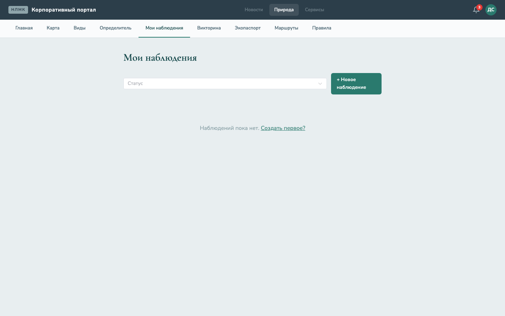

### Карта наблюдений
Яндекс Карты с кластеризацией точек наблюдений, фильтрами по группе и статусу, легендой и списком наблюдений в боковой панели.

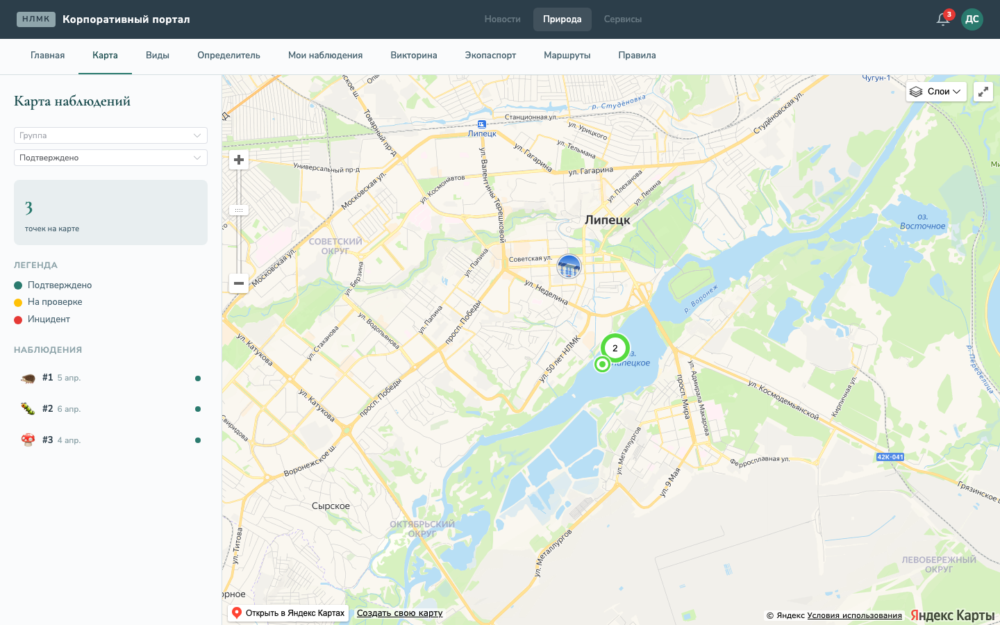

### Определитель видов
Пошаговый wizard: выбор группы по фотографии, затем сетка видов с фото для идентификации. Помогает сотрудникам определить, что они встретили.

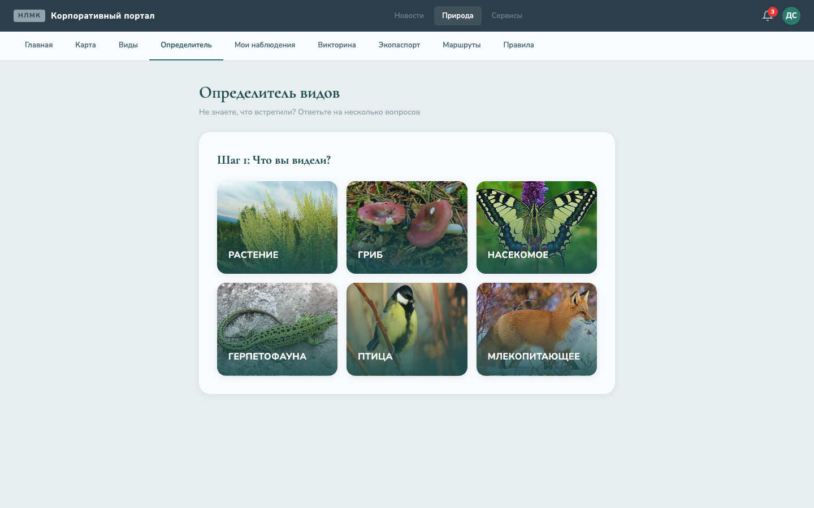

### Форма инцидента
Режим инцидента — для экстренных ситуаций (раненое/погибшее животное). Автоматически активируется при переходе с кнопки «Инцидент». Тип и серьёзность инцидента.

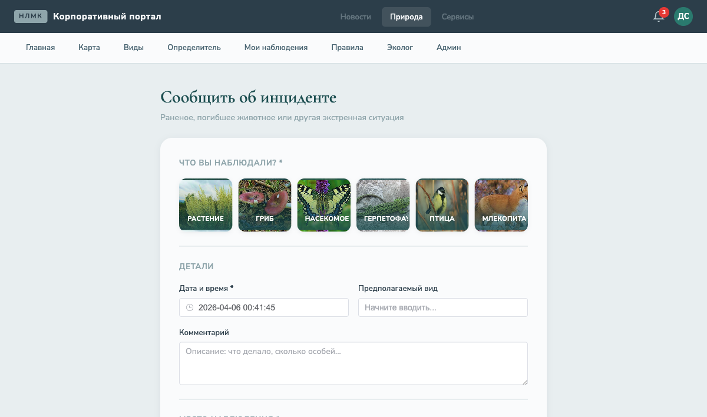

### Правила и помощь
Инструкции по технике безопасности, создание наблюдений, определение видов, статусы, контакты Управления технического заказчика.

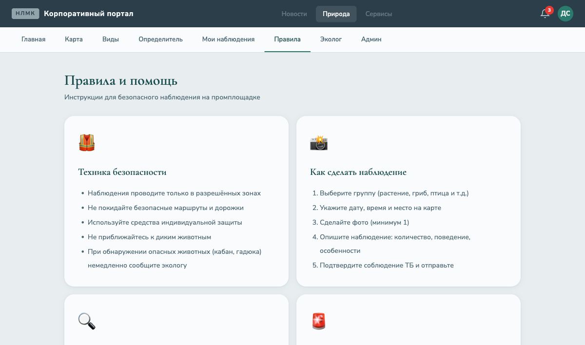

### Профиль и геймификация
Личный профиль сотрудника: баллы, количество наблюдений, видов, открытий. Заработанные достижения (бейджи). Лидерборд с фильтром по периоду (месяц/квартал/год/всё время). Факт дня.

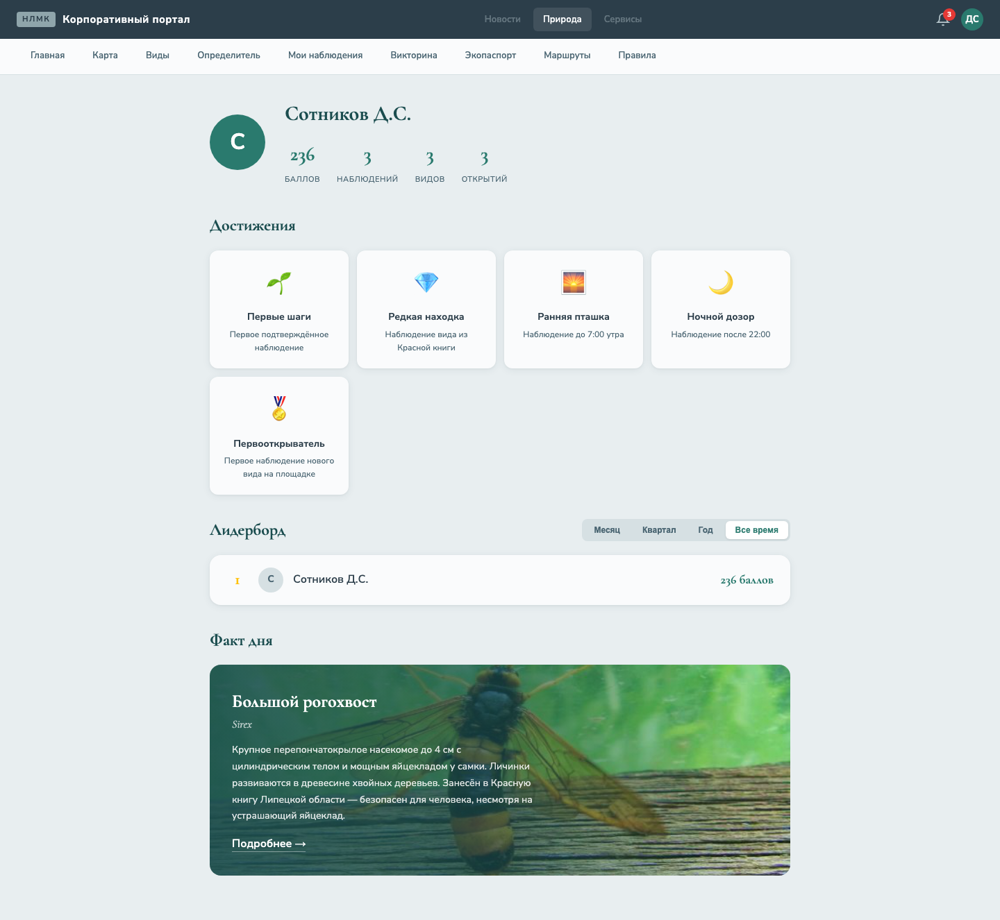

### Викторина «Угадай вид»
Показывается фото из каталога — нужно выбрать правильное название из 4 вариантов. Счётчик правильных ответов и серий.

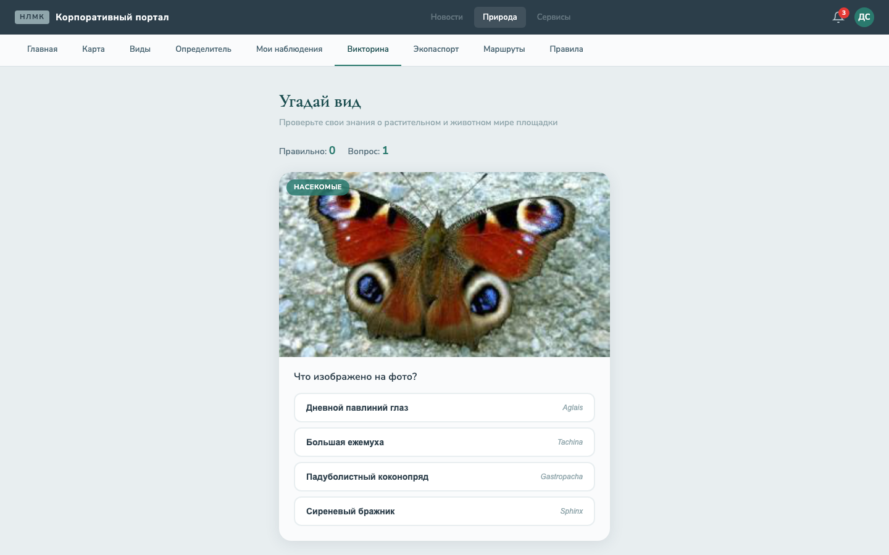

### Экологический паспорт площадки
Индекс биоразнообразия Шеннона (с тултипом-справкой), видовой состав по группам с фотографиями, график сезонной динамики (текущий месяц выделен), фотогалерея представителей, карта наблюдений.

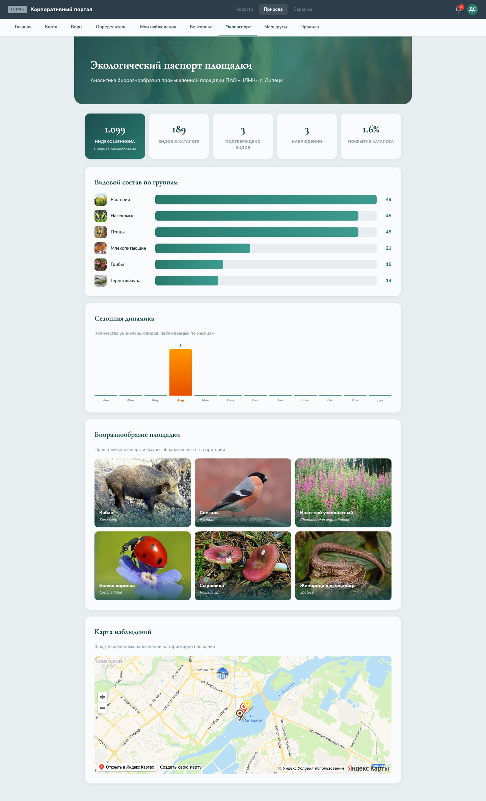

### Маршруты наблюдений
5 рекомендованных маршрутов по территории площадки: описание, дистанция, время, сложность, какие виды можно встретить, советы, лучшее время. Напоминание о технике безопасности.

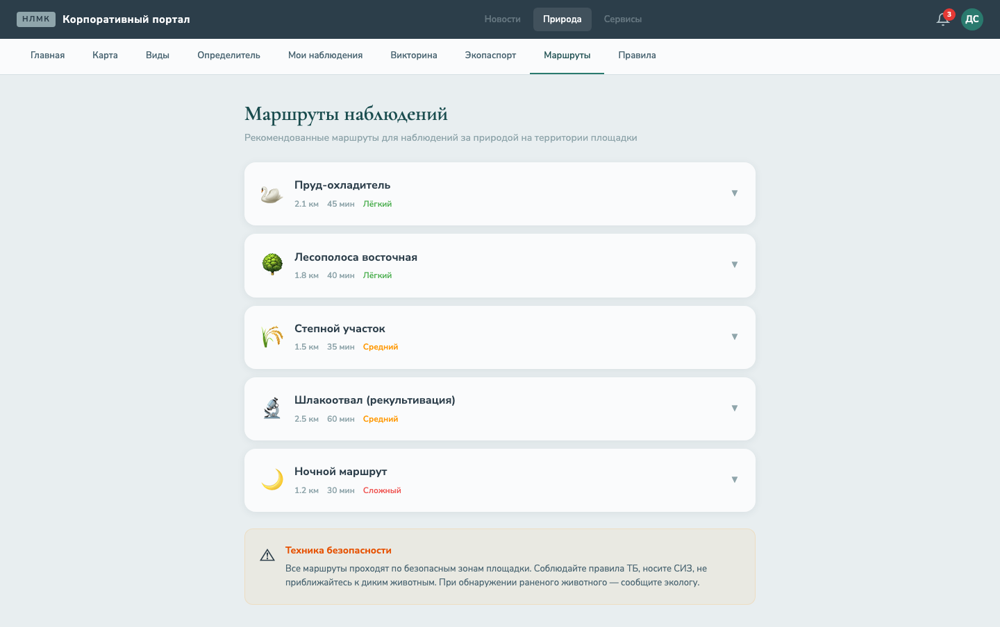

### Детали наблюдения
Фотография, вид, группа, статус, карта с точкой наблюдения (Яндекс Карты). Лайки и комментарии — социальные механики для обсуждения находок.

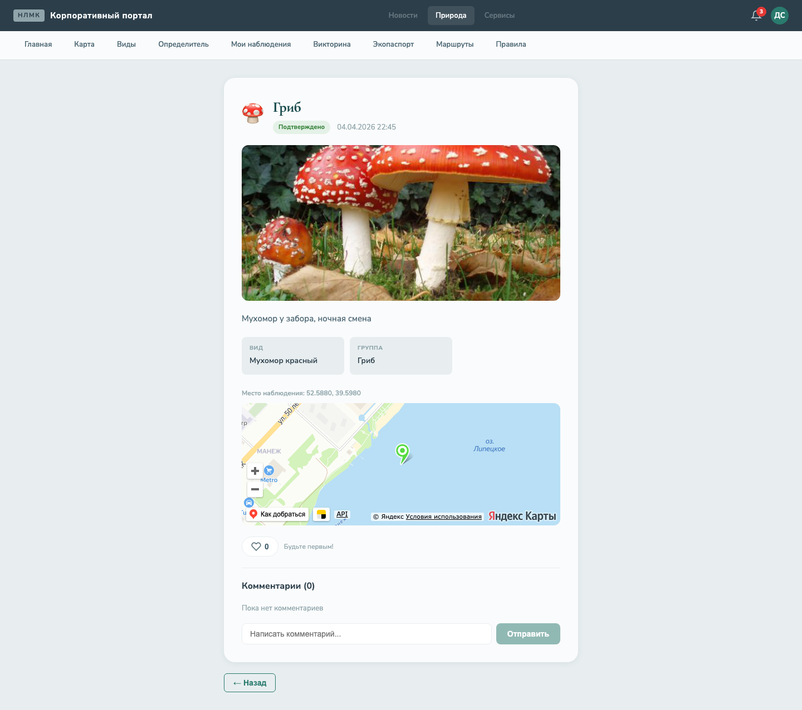

### Кабинет эколога
Очередь валидации с табами по статусам. Подтверждение, отклонение, запрос уточнений. Доступен только пользователям с ролью «Эколог» или «Администратор».

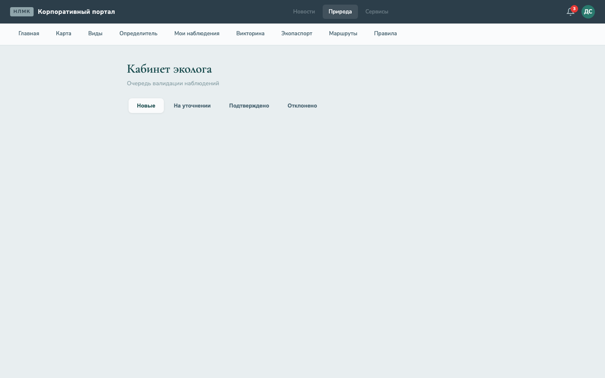

### Админ-панель
Управление справочником видов, импорт GeoJSON зон площадки. Доступна только администраторам.

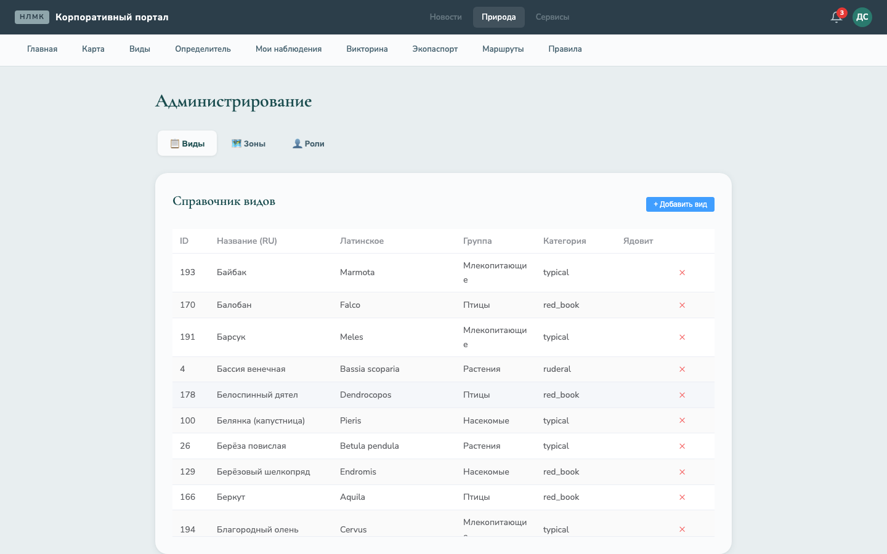

### Вход (dev-режим)
Выбор роли для разработки (Сотрудник / Эколог / Администратор). В продакшене — вход через корпоративный SSO (Blitz Identity Provider).

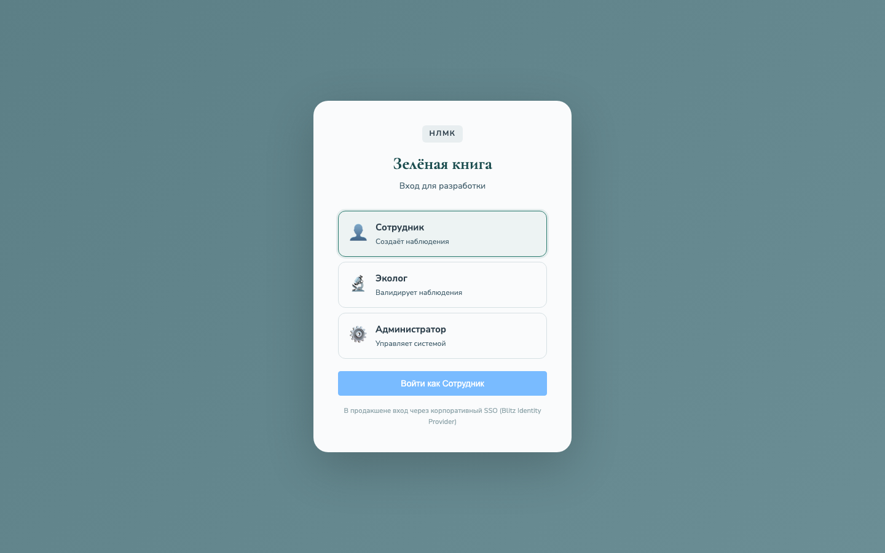

---

## Геймификация

Система мотивации поощряет сотрудников активно наблюдать за природой на территории площадки.

### Как работает

1. **Сотрудник** создаёт наблюдение: выбирает группу, ставит точку на карте, загружает фото
2. **Эколог** проверяет и подтверждает наблюдение
3. При подтверждении автоматически:
   - Начисляются **баллы** (1-30 за наблюдение)
   - Проверяются условия **достижений** (11 бейджей)
   - Записывается **первооткрыватель** вида (если вид обнаружен впервые)

### Баллы

| Категория вида | Базовые баллы |
|---|---|
| Типичный / синантроп / рудеральный | 1 |
| Редкий | 5 |
| Красная книга | 10 |

**Множители:**
- **×3** — первое наблюдение вида на площадке (first discovery)
- **×2** — наблюдение в правильный сезон для вида

### Достижения (11 бейджей)

| Бейдж | Условие | Баллы |
|---|---|---|
| 🌱 Первые шаги | Первое подтверждённое наблюдение | +10 |
| 🔬 Натуралист | 10 подтверждённых наблюдений | +50 |
| 🏆 Эксперт | 50 подтверждённых наблюдений | +200 |
| 🌈 Все группы | Наблюдения из каждой из 6 групп | +100 |
| 💎 Редкая находка | Наблюдение вида из Красной книги | +50 |
| 🌅 Ранняя пташка | Наблюдение до 7:00 утра | +20 |
| 🌙 Ночной дозор | Наблюдение после 22:00 | +20 |
| 🍂 Сезонный охотник | Наблюдения в 4 разных сезона | +100 |
| 📸 Фотограф | 5 наблюдений с фото | +30 |
| 🚨 Спасатель | Сообщение об инциденте | +30 |
| 🏅 Первооткрыватель | Первое наблюдение нового вида | +100 |

### Челлендж месяца

Каждый месяц на главной странице выделяется целевой вид из Красной книги. Кто первый найдёт и подтвердит наблюдение — получает специальный бейдж.

### Лидерборд

Рейтинг наблюдателей по баллам с фильтрацией по периоду: месяц, квартал, год, всё время. Топ-3 выделены золотом, серебром и бронзой.

### Социальные механики

- **Комментарии** к наблюдениям — эколог может похвалить, коллеги могут спросить совет
- **Лайки** на наблюдения — отмечайте интересные находки
- **Лента «Последние находки»** на главной — свежие подтверждённые наблюдения

---

## Образование

### Викторина «Угадай вид»
Показывается фото из каталога — нужно выбрать правильное название из 4 вариантов (предпочтительно из той же группы). Счётчик правильных ответов и серий подряд.

### Факт дня
Случайный вид из каталога с описанием — на главной странице и в профиле. Меняется при каждом заходе.

### Определитель видов
Пошаговый визард: выбор группы по фотографии → сетка видов для идентификации.

### Маршруты наблюдений
5 рекомендованных маршрутов по территории: пруд-охладитель (водоплавающие), лесополоса (мелкие птицы), степной участок (насекомые, ящерицы), шлакоотвал (рекультивация), ночной маршрут (летучие мыши, ежи).

---

## Экологический паспорт

Аналитическая страница для ESG-отчётности и мониторинга биоразнообразия:

- **Индекс Шеннона** (H') — мера биоразнообразия: H' = -Σ(pᵢ × ln pᵢ). Шкала: <1 низкое, 1-2 среднее, 2-3 высокое, >3 очень высокое
- **Видовой состав по группам** — столбчатая диаграмма с фото
- **Сезонная динамика** — количество видов по месяцам
- **Карта наблюдений** — точки наблюдений с цветовой кодировкой по группам

---

## Архитектура

```
┌─────────────────────────────────────────────────┐
│              Битрикс (nlmk.one)                 │
│  ┌───────────┐  ┌────────────────────────────┐  │
│  │ SSO/Auth  │  │  Vue.js SPA                │  │
│  │ (Blitz    │  │  «Животный и растительный  │  │
│  │  OAuth)   │  │   мир»                     │  │
│  └─────┬─────┘  └─────────────┬──────────────┘  │
└────────┼──────────────────────┼──────────────────┘
         │ JWT/token            │ REST API
         ▼                     ▼
┌─────────────────────────────────────────────────┐
│           FastAPI Backend                       │
│  ┌──────────┐ ┌──────────┐ ┌──────────────────┐ │
│  │Наблюдения│ │Справочник│ │ Geo-сервис       │ │
│  │& инцид.  │ │видов     │ │ (зоны, point-in- │ │
│  │          │ │          │ │  polygon)        │ │
│  └────┬─────┘ └────┬─────┘ └───────┬──────────┘ │
│       │            │               │            │
│  ┌────┴────────────┴───────────────┴──────────┐ │
│  │         SQLAlchemy + GeoAlchemy2           │ │
│  └────────────────────┬───────────────────────┘ │
└───────────────────────┼─────────────────────────┘
                        │
         ┌──────────────┼──────────────┐
         ▼              ▼              ▼
   ┌──────────┐  ┌──────────┐  ┌──────────┐
   │PostgreSQL│  │  MinIO   │  │  Redis   │
   │+ PostGIS │  │  (медиа) │  │(кэш,     │
   │          │  │          │  │ сессии)  │
   └──────────┘  └──────────┘  └──────────┘
```

---

## Технологический стек

| Компонент | Технология |
|---|---|
| **Backend** | Python 3.12, FastAPI, SQLAlchemy 2.0, GeoAlchemy2, Alembic |
| **Frontend** | Vue 3, TypeScript, Vite, Pinia, Vue Router, Element Plus |
| **БД** | PostgreSQL 16 + PostGIS 3.4 |
| **Карты** | Яндекс Карты JS API 2.1 |
| **Медиа** | MinIO (S3-совместимое хранилище) |
| **Кэш** | Redis 7 |
| **Инфраструктура** | Docker, Docker Compose |
| **Аутентификация** | JWT (Blitz SSO в продакшене) |

---

## API-эндпоинты (35+)

| Группа | Эндпоинты | Описание |
|---|---|---|
| **Health** | `GET /api/health` | Проверка состояния |
| **Species** | `GET/POST /api/species`, `GET/PUT/DELETE /api/species/{id}` | CRUD справочника видов |
| **Observations** | `POST/GET /api/observations`, `GET /my`, `GET/{id}`, `PATCH/{id}` | Наблюдения сотрудников |
| **Comments** | `GET/POST /api/observations/{id}/comments` | Комментарии к наблюдениям |
| **Likes** | `GET/POST /api/observations/{id}/likes`, `GET /{id}/likes/me` | Лайки наблюдений |
| **Media** | `POST /api/observations/upload-url`, `POST /{id}/media` | Загрузка медиа через presigned URL |
| **Validation** | `GET /queue`, `POST /{id}/confirm\|reject\|request-data` | Валидация экологом |
| **Notifications** | `GET`, `PATCH /{id}/read`, `GET /unread-count` | Уведомления |
| **Map** | `GET /observations`, `GET /zones`, `GET /zone-by-point` | GeoJSON для карты |
| **Gamification** | `GET /leaderboard\|profile\|stats\|challenge\|quiz\|fact-of-day` | Геймификация |
| **Identifier** | `GET /tree`, `POST /suggest` | Дерево определителя |
| **Export** | `GET /observations` | Выгрузка в XLSX |
| **Admin** | `POST /zones/import` | Импорт зон (GeoJSON) |
| **Config** | `GET /config/ymaps` | API-ключ карт |
| **Dev Auth** | `POST /dev/token` | JWT для разработки |

---

## Страницы (17)

| Путь | Страница | Описание |
|---|---|---|
| `/` | Главная | Hero, статистика, вид месяца с челленджем, факт дня, каталог, лента находок |
| `/species` | Справочник видов | 189 видов, фильтры, поиск |
| `/species/:id` | Карточка вида | Фото, описание, статус, первооткрыватель |
| `/observe` | Новое наблюдение | Форма с картой, фото, группой |
| `/my` | Мои наблюдения | Список со статусами и фото |
| `/observations/:id` | Детали наблюдения | Фото, карта, комментарии, лайки |
| `/map` | Карта наблюдений | Яндекс Карты + кластеризация |
| `/identify` | Определитель | Wizard с фото для идентификации |
| `/quiz` | Викторина | «Угадай вид» по фото |
| `/passport` | Экопаспорт | Индекс Шеннона, графики, галерея |
| `/routes` | Маршруты | 5 маршрутов наблюдений |
| `/profile` | Профиль | Баллы, достижения, лидерборд |
| `/expert` | Кабинет эколога | Очередь валидации |
| `/admin` | Администрирование | Виды, зоны, роли |
| `/help` | Правила и помощь | ТБ, инструкции, контакты |
| `/login` | Вход (dev) | Выбор роли |

---

## Ролевая модель

| Роль | Возможности | Навигация |
|---|---|---|
| **Сотрудник** | Создание наблюдений, просмотр каталога и карты, викторина, профиль | Все вкладки кроме «Эколог» и «Админ» |
| **Эколог** | + Валидация наблюдений, экспорт данных | + вкладка «Эколог» |
| **Администратор** | + Управление справочниками, импорт зон | + вкладки «Эколог» и «Админ» |

---

## Данные

- **189 видов** из «Зелёной книги ПАО НЛМК» (PDF, 32 стр.)
- **6 групп**: растения (49), грибы (15), насекомые (45), герпетофауна (14), птицы (45), млекопитающие (21)
- **189 описаний** — научно-популярные тексты для каждого вида
- **194 фотографии** — извлечены из PDF каталога
- **49 узлов** дерева определителя для всех 6 групп
- **11 достижений** — бейджи с условиями и бонусными баллами
- **5 маршрутов** — рекомендованные маршруты наблюдений

---

## Быстрый старт

### Требования
- Docker и Docker Compose
- API-ключ Яндекс Карт (v2.1)

### Запуск

```bash
# Клонировать
git clone https://github.com/Dmitry-100/green-book-nlmk.git
cd green-book-nlmk

# Настроить окружение
cp .env.example .env
# Отредактировать .env — добавить YMAPS_API_KEY

# Запустить все сервисы
docker compose up --build -d

# Применить миграции
docker compose exec backend alembic upgrade head

# Загрузить данные
docker compose exec backend python -m app.seed.run_seed
docker compose exec backend python -m app.seed.seed_tree
docker compose exec backend python -m app.seed.seed_achievements
docker compose exec backend python -m app.seed.seed_demo
```

### Доступ

| Сервис | URL |
|---|---|
| Frontend | http://localhost:5173 |
| Backend API | http://localhost:8000 |
| Swagger UI | http://localhost:8000/docs |
| MinIO Console | http://localhost:9001 |
| Dev Login | http://localhost:5173/login |

---

## Структура проекта

```
green-book-nlmk/
├── docker-compose.yml          # Оркестрация сервисов
├── .env.example                # Шаблон переменных окружения
├── backend/
│   ├── Dockerfile
│   ├── pyproject.toml
│   ├── alembic.ini
│   ├── migrations/             # Alembic миграции
│   └── app/
│       ├── main.py             # FastAPI приложение
│       ├── config.py           # Настройки
│       ├── database.py         # SQLAlchemy engine
│       ├── auth.py             # JWT + RBAC
│       ├── models/             # SQLAlchemy модели
│       ├── schemas/            # Pydantic схемы
│       ├── routers/            # API-роутеры
│       ├── services/           # Бизнес-логика (media, geo, gamification)
│       ├── seed/               # Начальные данные
│       └── tests/
├── frontend/
│   ├── Dockerfile
│   ├── package.json
│   ├── vite.config.ts
│   └── src/
│       ├── main.ts
│       ├── App.vue
│       ├── assets/main.css     # Глобальные стили
│       ├── router/             # Vue Router (17 маршрутов)
│       ├── stores/             # Pinia (auth)
│       ├── api/                # Axios клиент
│       ├── components/         # SpeciesCard
│       ├── layouts/            # MainLayout
│       └── views/              # 17 страниц
└── docs/
    ├── screenshots/            # Скриншоты (17 экранов)
    └── superpowers/            # Спецификации и планы
```

---

## Источники данных

Проект основан на материалах:
- **Зелёная книга ПАО «НЛМК»** (2026) — каталог видов, 32 стр.
- **Атлас растительного и животного мира ПАО НЛМК** (2025) — предыдущая версия
- **Проект технического задания для интеграции на портал** — функциональные требования

---

## Лицензия

Внутренний проект ПАО «НЛМК». Все права защищены.
