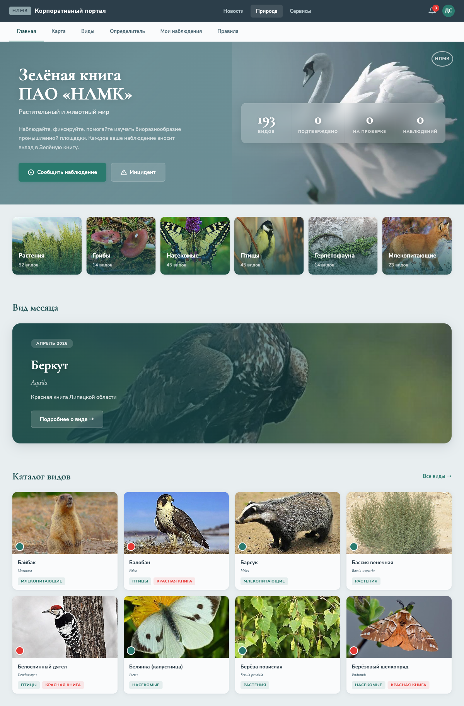
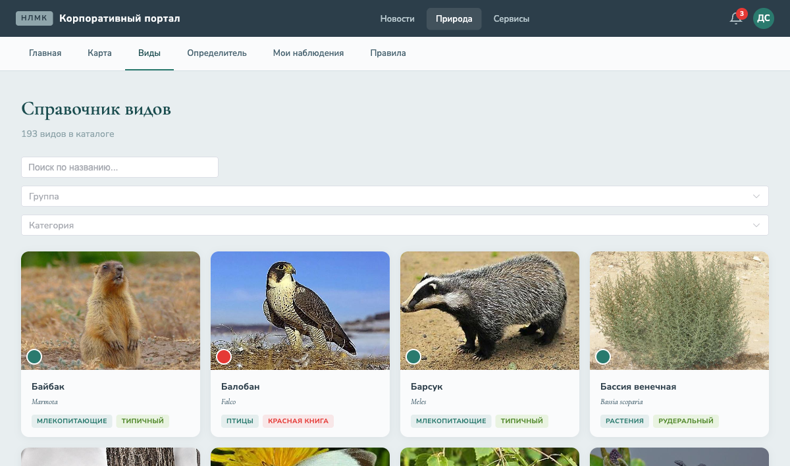
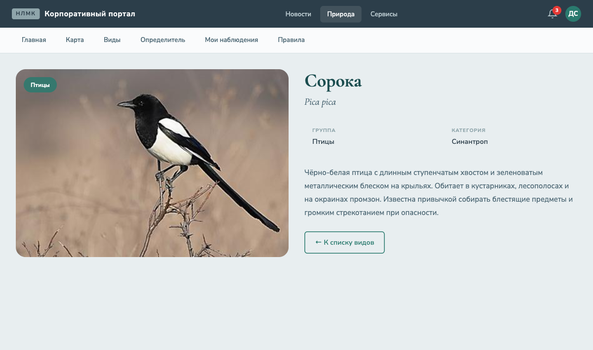
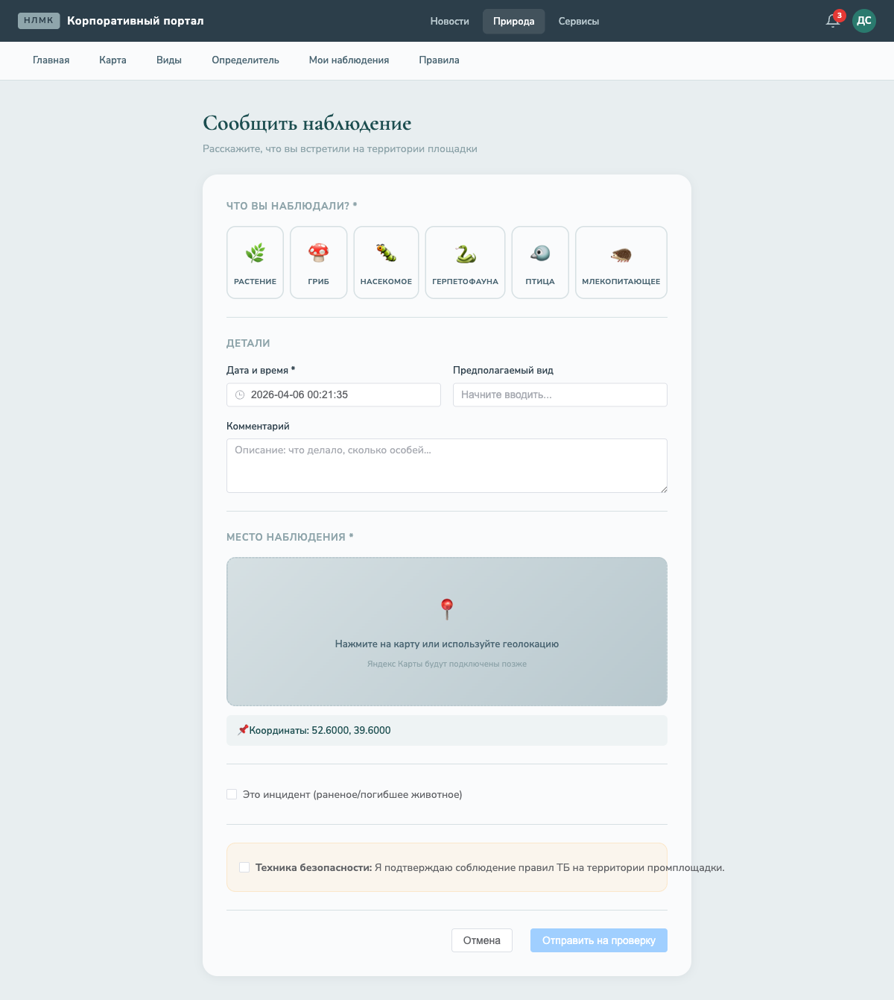
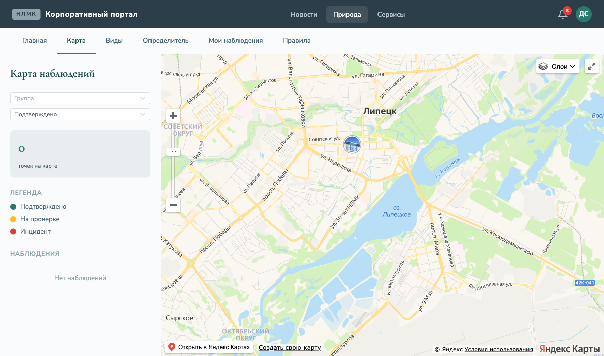
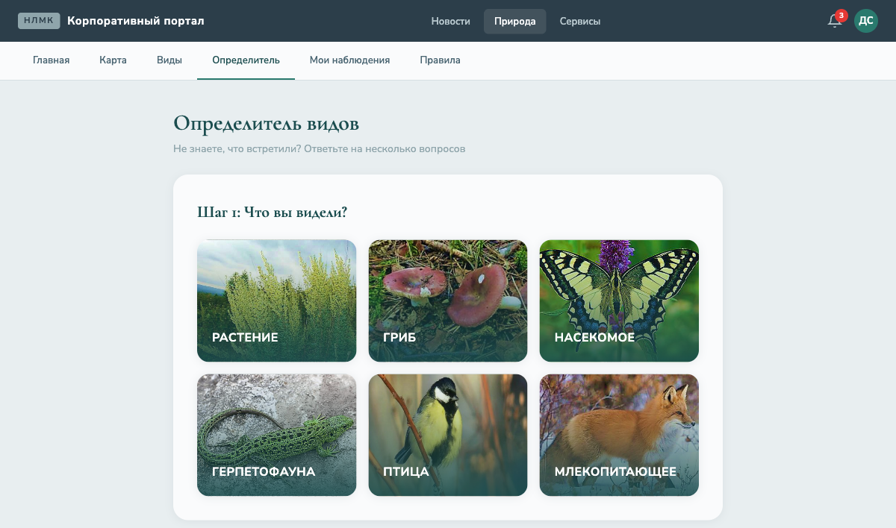
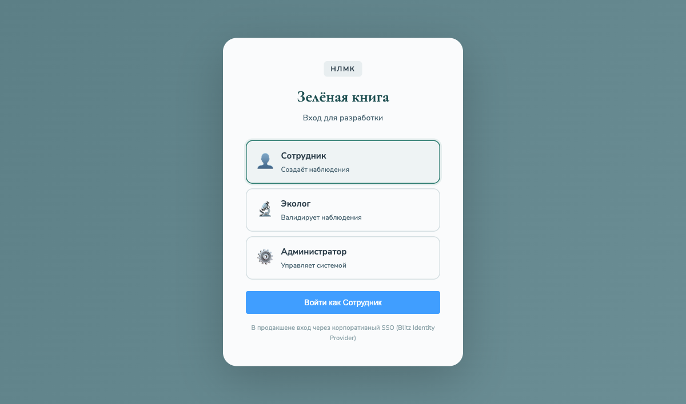

# Зелёная книга ПАО «НЛМК»

Интерактивный портал для фиксации и валидации наблюдений за растительным и животным миром на промышленной площадке ПАО «НЛМК» (г. Липецк).

Проект превращает статичный PDF-каталог «Зелёная книга» в живую веб-платформу, где сотрудники наблюдают за природой, экологи валидируют находки, а все данные собираются на интерактивной карте.

---

## Скриншоты

### Главная страница
Hero-секция с лебедем из обложки «Зелёной книги», статистика в реальном времени, карточки групп с фотографиями, «Вид месяца» и каталог видов.



### Справочник видов
193 вида из «Зелёной книги» с фотографиями, фильтрами по группе/категории и поиском по названию (русскому и латинскому).



### Карточка вида
Детальная информация о виде: фотография, группа, категория, охранный статус, описание, правила поведения.



### Форма наблюдения
Выбор группы, дата/время, место на карте с автоопределением зоны площадки, загрузка фото, чекбокс ТБ, режим инцидента.



### Карта наблюдений
Яндекс Карты с кластеризацией точек наблюдений, фильтрами по группе и статусу, легендой и списком наблюдений в боковой панели.



### Определитель видов
Пошаговый wizard: выбор группы по фотографии, затем сетка видов с фото для идентификации. Помогает сотрудникам определить, что они встретили.



### Вход (dev-режим)
Выбор роли для разработки. В продакшене — вход через корпоративный SSO (Blitz Identity Provider).



---

## Архитектура

```
┌─────────────────────────────────────────────────┐
│              Битрикс (nlmk.one)                 │
│  ┌───────────┐  ┌────────────────────────────┐  │
│  │ SSO/Auth  │  │  Vue.js SPA                │  │
│  │ (Blitz    │  │  «Животный и растительный  │  │
│  │  OAuth)   │  │   мир»                     │  │
│  └─────┬─────┘  └─────────────┬──────────────┘  │
└────────┼──────────────────────┼──────────────────┘
         │ JWT/token            │ REST API
         ▼                     ▼
┌─────────────────────────────────────────────────┐
│           FastAPI Backend                       │
│  ┌──────────┐ ┌──────────┐ ┌──────────────────┐ │
│  │Наблюдения│ │Справочник│ │ Geo-сервис       │ │
│  │& инцид.  │ │видов     │ │ (зоны, point-in- │ │
│  │          │ │          │ │  polygon)        │ │
│  └────┬─────┘ └────┬─────┘ └───────┬──────────┘ │
│       │            │               │            │
│  ┌────┴────────────┴───────────────┴──────────┐ │
│  │         SQLAlchemy + GeoAlchemy2           │ │
│  └────────────────────┬───────────────────────┘ │
└───────────────────────┼─────────────────────────┘
                        │
         ┌──────────────┼──────────────┐
         ▼              ▼              ▼
   ┌──────────┐  ┌──────────┐  ┌──────────┐
   │PostgreSQL│  │  MinIO   │  │  Redis   │
   │+ PostGIS │  │  (медиа) │  │(кэш,     │
   │          │  │          │  │ сессии)  │
   └──────────┘  └──────────┘  └──────────┘
```

---

## Технологический стек

| Компонент | Технология |
|---|---|
| **Backend** | Python 3.12, FastAPI, SQLAlchemy 2.0, GeoAlchemy2, Alembic |
| **Frontend** | Vue 3, TypeScript, Vite, Pinia, Vue Router, Element Plus |
| **БД** | PostgreSQL 16 + PostGIS 3.4 |
| **Карты** | Яндекс Карты JS API 2.1 |
| **Медиа** | MinIO (S3-совместимое хранилище) |
| **Кэш** | Redis 7 |
| **Инфраструктура** | Docker, Docker Compose |
| **Аутентификация** | JWT (Blitz SSO в продакшене) |

---

## API-эндпоинты (27)

| Группа | Эндпоинты | Описание |
|---|---|---|
| **Health** | `GET /api/health` | Проверка состояния |
| **Species** | `GET/POST /api/species`, `GET/PUT/DELETE /api/species/{id}` | CRUD справочника видов |
| **Observations** | `POST/GET /api/observations`, `GET /my`, `GET/{id}`, `PATCH/{id}` | Наблюдения сотрудников |
| **Media** | `POST /api/observations/upload-url`, `POST /{id}/media` | Загрузка медиа через presigned URL |
| **Validation** | `GET /queue`, `POST /{id}/confirm\|reject\|request-data` | Валидация экологом |
| **Notifications** | `GET`, `PATCH /{id}/read`, `GET /unread-count` | Уведомления |
| **Map** | `GET /observations`, `GET /zones`, `GET /zone-by-point` | GeoJSON для карты |
| **Identifier** | `GET /tree`, `POST /suggest` | Дерево определителя |
| **Export** | `GET /observations` | Выгрузка в XLSX |
| **Admin** | `POST /zones/import` | Импорт зон (GeoJSON) |
| **Config** | `GET /config/ymaps` | API-ключ карт |
| **Dev Auth** | `POST /dev/token` | JWT для разработки |

---

## Страницы (11)

| Путь | Страница | Описание |
|---|---|---|
| `/` | Главная | Hero с лебедем, статистика, каталог, вид месяца |
| `/species` | Справочник видов | 193 вида, фильтры, поиск |
| `/species/:id` | Карточка вида | Фото, описание, статус, правила |
| `/observe` | Новое наблюдение | Форма с выбором группы, картой, медиа |
| `/my` | Мои наблюдения | Список со статусами |
| `/map` | Карта наблюдений | Яндекс Карты + кластеризация |
| `/identify` | Определитель | Wizard с фото для идентификации |
| `/expert` | Кабинет эколога | Очередь валидации |
| `/admin` | Администрирование | Виды, зоны, роли |
| `/help` | Правила и помощь | ТБ, инструкции, контакты |
| `/login` | Вход (dev) | Выбор роли для разработки |

---

## Ролевая модель

| Роль | Возможности |
|---|---|
| **Employee** | Создание наблюдений, просмотр каталога и карты |
| **Ecologist** | Валидация наблюдений, экспорт данных, управление чувствительностью |
| **Admin** | Управление справочниками, импорт зон, назначение ролей |

---

## Данные

- **193 вида** из «Зелёной книги ПАО НЛМК» (PDF, 32 стр.)
- **6 групп**: растения (52), грибы (14), насекомые (45), герпетофауна (14), птицы (45), млекопитающие (23)
- **193 описания** — научно-популярные тексты для каждого вида
- **194 фотографии** — извлечены из PDF каталога
- **49 узлов** дерева определителя для всех 6 групп

---

## Быстрый старт

### Требования
- Docker и Docker Compose
- API-ключ Яндекс Карт (v2.1)

### Запуск

```bash
# Клонировать
git clone https://github.com/Dmitry-100/green-book-nlmk.git
cd green-book-nlmk

# Настроить окружение
cp .env.example .env
# Отредактировать .env — добавить YMAPS_API_KEY

# Запустить все сервисы
docker compose up --build -d

# Применить миграции
docker compose exec backend alembic upgrade head

# Загрузить данные
docker compose exec backend python -m app.seed.run_seed
docker compose exec backend python -m app.seed.seed_tree
```

### Доступ

| Сервис | URL |
|---|---|
| Frontend | http://localhost:5173 |
| Backend API | http://localhost:8000 |
| Swagger UI | http://localhost:8000/docs |
| MinIO Console | http://localhost:9001 |
| Dev Login | http://localhost:5173/login |

---

## Структура проекта

```
green-book-nlmk/
├── docker-compose.yml          # Оркестрация сервисов
├── .env.example                # Шаблон переменных окружения
├── backend/
│   ├── Dockerfile
│   ├── pyproject.toml
│   ├── alembic.ini
│   ├── migrations/             # Alembic миграции
│   └── app/
│       ├── main.py             # FastAPI приложение
│       ├── config.py           # Настройки
│       ├── database.py         # SQLAlchemy engine
│       ├── auth.py             # JWT + RBAC
│       ├── models/             # 7 моделей (User, Species, Observation, ...)
│       ├── schemas/            # Pydantic схемы
│       ├── routers/            # API-роутеры (10 модулей)
│       ├── services/           # Бизнес-логика (media, geo)
│       ├── seed/               # Начальные данные
│       └── tests/
├── frontend/
│   ├── Dockerfile
│   ├── package.json
│   ├── vite.config.ts
│   └── src/
│       ├── main.ts
│       ├── App.vue
│       ├── assets/main.css     # Глобальные стили
│       ├── router/             # Vue Router
│       ├── stores/             # Pinia (auth)
│       ├── api/                # Axios клиент
│       ├── components/         # SpeciesCard
│       ├── layouts/            # MainLayout
│       └── views/              # 11 страниц
└── docs/
    ├── screenshots/            # Скриншоты
    └── plans/                  # Планы реализации
```

---

## Источники данных

Проект основан на материалах:
- **Зелёная книга ПАО «НЛМК»** (2026) — каталог видов, 32 стр.
- **Атлас растительного и животного мира ПАО НЛМК** (2025) — предыдущая версия
- **Проект технического задания для интеграции на портал** — функциональные требования

---

## Лицензия

Внутренний проект ПАО «НЛМК». Все права защищены.
